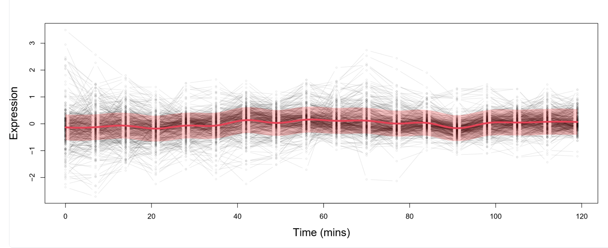
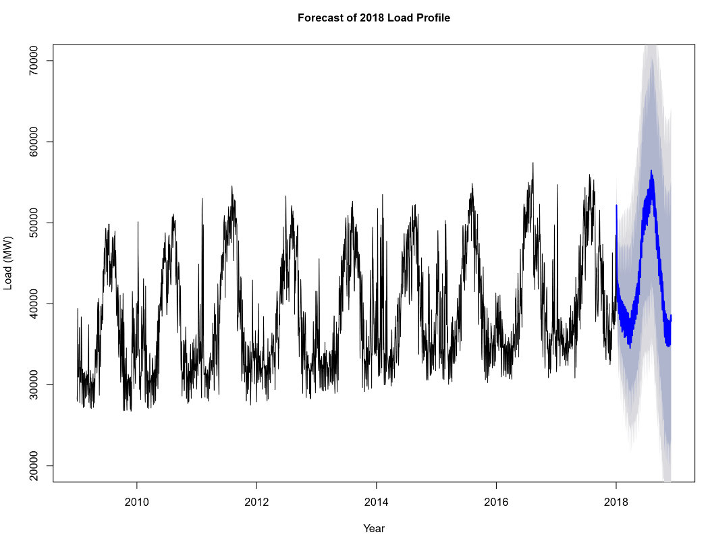
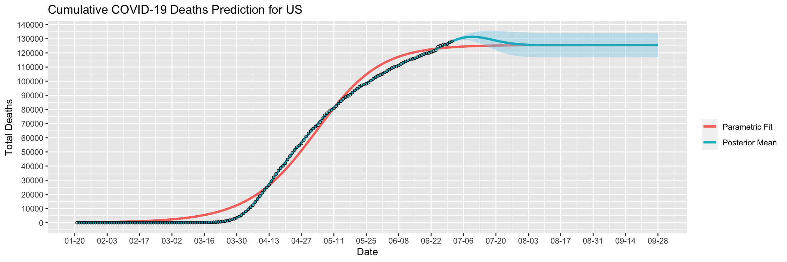

# Research

## Bayesian Framework for Analyzing Sparse Functional Data

Functional data assumes that the unit of analysis in function, typically curves or surfaces. In sparse functional data setting, curves are observed on different points and even different number of points for each subject. We have developed a Bayesian framework for analyzing such a data leveraging the power of Gaussian process. We have applied our model in different settings such as bone mineral density dataset (longitudinal study) and temporal gene expression data.

 unnamed-chunk-2-1.png

## COVID-19 cases and deaths projection using Gaussian process regression with Richard’s curve prior

This is a small project to display the power of Gaussian process regression and incorportation of prior mean function. Details can be found here: https://tahmid-usc.github.io/covidGP

## Forecast electricity power load in Texas with TBATS model

We have used state space exponential smoothing model ('forecast' package in R) to forecast the power load in Texas. We have found that the statistical model performs better than LSTM deep learning model for this particular case.

## 
